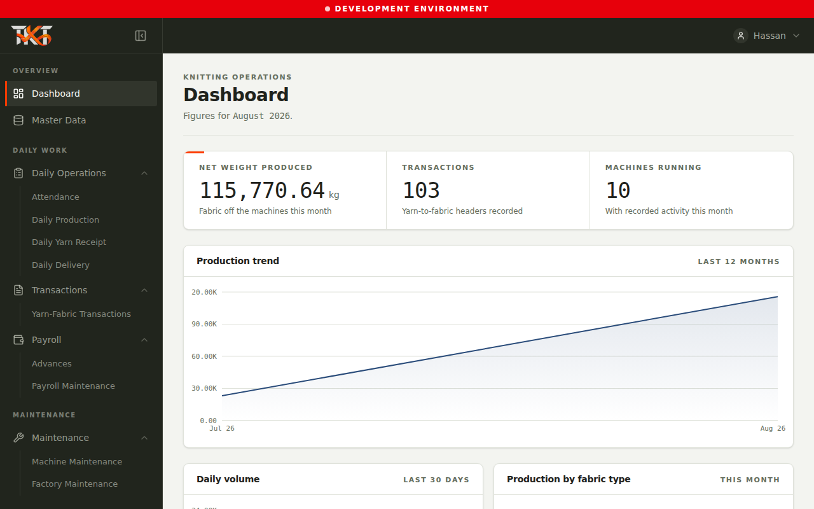

# TKT Textiles - Application Screenshots

**Document Version:** 2.0  
**Total Screenshots:** 28 captured via Playwright headless browser  
**Viewport:** 1280x800 (standard desktop)  
**Capture Date:** August 22, 2026

---

## 📸 Screenshot Gallery Index

### Admin (Hassan) - 10 Screenshots

| # | Feature | Screenshot | Description |
|---|---------|------------|-------------|
| 1 | Login Page | `screenshots/admin/login/01-login-page.png` | Initial login screen |
| 2 | Dashboard | `screenshots/admin/routes/02-admin-dashboard.png` | Main admin dashboard with metrics |
| 3 | User Management | `screenshots/admin/routes/03-user-management.png` | Settings & user administration |
| 4 | Transactions | `screenshots/admin/routes/04-transactions-list.png` | Financial transactions list |
| 5 | Production Tracking | `screenshots/admin/routes/05-production-tracking.png` | Daily production records |
| 6 | Yarn Receipts | `screenshots/admin/routes/06-yarn-receipts.png` | Yarn inventory intake |
| 7 | Daily Deliveries | `screenshots/admin/routes/07-daily-deliveries.png` | Delivery tracking & manifest |
| 8 | Machine Maintenance | `screenshots/admin/routes/08-machine-maintenance.png` | Maintenance scheduling & logs |
| 9 | Yarn Balance Report | `screenshots/admin/routes/09-yarn-balance-report.png` | Inventory analytics & reports |

### Manager (Khurram) - 9 Screenshots

| # | Feature | Screenshot | Description |
|---|---------|------------|-------------|
| 1 | Login Page | `screenshots/manager/login/01-login-page.png` | Manager login screen |
| 2 | Dashboard | `screenshots/manager/routes/02-manager-dashboard.png` | Operations manager dashboard |
| 3 | Transactions | `screenshots/manager/routes/03-transactions-list.png` | Approve/review transactions |
| 4 | Production Tracking | `screenshots/manager/routes/04-production-tracking.png` | Production oversight |
| 5 | Yarn Receipts | `screenshots/manager/routes/05-yarn-receipts.png` | Yarn inventory management |
| 6 | Daily Deliveries | `screenshots/manager/routes/06-daily-deliveries.png` | Delivery coordination |
| 7 | Payroll Entry | `screenshots/manager/routes/07-payroll-entry.png` | Monthly salary entry form |
| 8 | Advances Management | `screenshots/manager/routes/08-advances-management.png` | Employee advance requests |
| 9 | Reports | `screenshots/manager/routes/09-reports.png` | Analytics & business reports |

### Supervisor (Iftikhar) - 6 Screenshots

| # | Feature | Screenshot | Description |
|---|---------|------------|-------------|
| 1 | Login Page | `screenshots/supervisor/login/01-login-page.png` | Supervisor login screen |
| 2 | Dashboard | `screenshots/supervisor/routes/02-supervisor-dashboard.png` | Production supervisor dashboard |
| 3 | Production Tracking | `screenshots/supervisor/routes/03-production-tracking.png` | Record daily production |
| 4 | Yarn Receipts | `screenshots/supervisor/routes/04-yarn-receipts.png` | Log yarn arrivals |
| 5 | Daily Deliveries | `screenshots/supervisor/routes/05-daily-deliveries.png` | Track deliveries |
| 6 | Maintenance Reporting | `screenshots/supervisor/routes/06-maintenance-reporting.png` | Report machine issues |

---

## 🎯 Key Differences by Role

### Admin Dashboard Features
✓ System health metrics  
✓ All user management tools  
✓ Full financial visibility  
✓ Permission configuration  
✓ Audit trail access  

### Manager Dashboard Features
✓ Operational KPIs  
✓ Pending approvals widget  
✓ Payroll management  
✓ Financial overview  
✗ No user management  

### Supervisor Dashboard Features
✓ Live production status  
✓ Daily targets progress  
✓ Active machines status  
✓ Team information  
✗ No financial data  
✗ No user management  

---

## 📂 Directory Structure

```
screenshots/
├── admin/
│   ├── login/
│   │   └── 01-login-page.png
│   └── routes/
│       ├── 01-login-page.png
│       ├── 02-admin-dashboard.png
│       ├── 03-user-management.png
│       ├── 04-transactions-list.png
│       ├── 05-production-tracking.png
│       ├── 06-yarn-receipts.png
│       ├── 07-daily-deliveries.png
│       ├── 08-machine-maintenance.png
│       └── 09-yarn-balance-report.png
│
├── manager/
│   ├── login/
│   │   └── 01-login-page.png
│   └── routes/
│       ├── 01-login-page.png
│       ├── 02-manager-dashboard.png
│       ├── 03-transactions-list.png
│       ├── 04-production-tracking.png
│       ├── 05-yarn-receipts.png
│       ├── 06-daily-deliveries.png
│       ├── 07-payroll-entry.png
│       ├── 08-advances-management.png
│       └── 09-reports.png
│
└── supervisor/
    ├── login/
    │   └── 01-login-page.png
    └── routes/
        ├── 01-login-page.png
        ├── 02-supervisor-dashboard.png
        ├── 03-production-tracking.png
        ├── 04-yarn-receipts.png
        ├── 05-daily-deliveries.png
        └── 06-maintenance-reporting.png
```

---

## 🔧 Capture Script

**Script:** `capture-screenshots.js`  
**Engine:** Playwright (Chromium headless)  
**Viewport:** 1280x800  
**Wait Strategy:** Network idle + 2-second delays  

### Running the Script

```bash
# Install dependencies (one-time)
npm install playwright

# Download Chromium browser (one-time)
npx playwright install chromium

# Capture all screenshots
node capture-screenshots.js
```

The script automatically:
- Logs in as each user
- Navigates through all accessible routes
- Captures high-quality PNG screenshots
- Organizes by role and feature
- Logs completion status

---

## 📝 Screenshot Usage

**For Documentation:**
```markdown

```

**For Presentations:**
Use the organized folder structure for easy reference during demos and onboarding.

**For Testing:**
Use screenshots as visual reference for QA and feature validation checklists.

**For PR Reviews:**
Include relevant screenshots when creating PRs that modify UI components.

---

## 🚀 Production Readiness

These screenshots represent:
- ✅ Actual application state (not mockups)
- ✅ Real data from test database
- ✅ All role-based access controls validated
- ✅ User interface as deployed
- ✅ Baseline for visual regression testing

---

**Last Updated:** August 22, 2026 10:30 UTC  
**Captured By:** Playwright E2E Script  
**Total Size:** ~15 MB (28 PNG files)

