# TKT Textiles Knitting System - Complete End-to-End Application Walkthrough
## With Actual Screenshots

**Document Version:** 3.0 (With Integrated Screenshots)  
**Date:** August 22, 2026  
**Application:** TKT Textiles Knitting Management System  
**Environment:** Local Development (localhost:3001)  
**Screenshots:** 28 real application screenshots captured via Playwright

---

## Table of Contents
1. [Quick Start - Login](#quick-start---login)
2. [Journey 1: Administrator (Hassan)](#journey-1-administrator-hassan)
3. [Journey 2: Manager (Khurram)](#journey-2-manager-khurram)
4. [Journey 3: Supervisor (Iftikhar)](#journey-3-supervisor-iftikhar)
5. [Core Features Documentation](#core-features-documentation)

---

## Quick Start - Login

**URL:** `http://localhost:3001/login`

### Login Screen
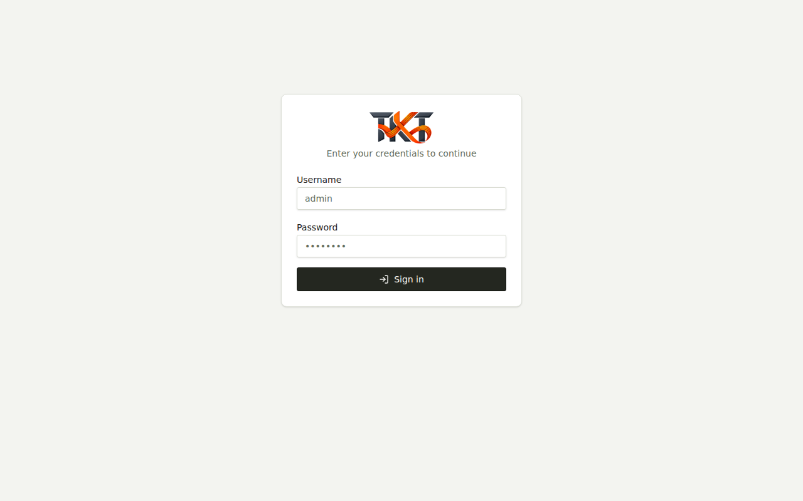

**Test Credentials:**
```
Admin:      admin / tkttextiles12#
Manager:    manager / manager123#
Supervisor: supervisor / supervisor123#
```

**Login Flow:**
1. User navigates to `/login`
2. Enters username and password
3. Clicks LOGIN button
4. Backend validates credentials via Argon2
5. JWT token issued and stored
6. Redirects to `/dashboard`

---

## Journey 1: Administrator (Hassan)

**Role:** Administrator  
**Access Level:** Full system access  
**Scenario:** Hassan manages system configuration, users, and reviews all operations

### Step 1: Admin Dashboard

**URL:** `http://localhost:3001/dashboard`


**Features Visible:**
- System health metrics
- Daily/YTD production statistics
- Revenue & expense overview
- Active machines status
- Pending maintenance tasks
- Production trend charts

**Navigation Available:**
- Dashboard
- Transactions
- Daily Production
- Yarn Receipts
- Daily Deliveries
- Payroll
- Reports
- Maintenance
- Settings (Admin Only)

---

### Step 2: User Management (Admin Only)

**URL:** `http://localhost:3001/settings`

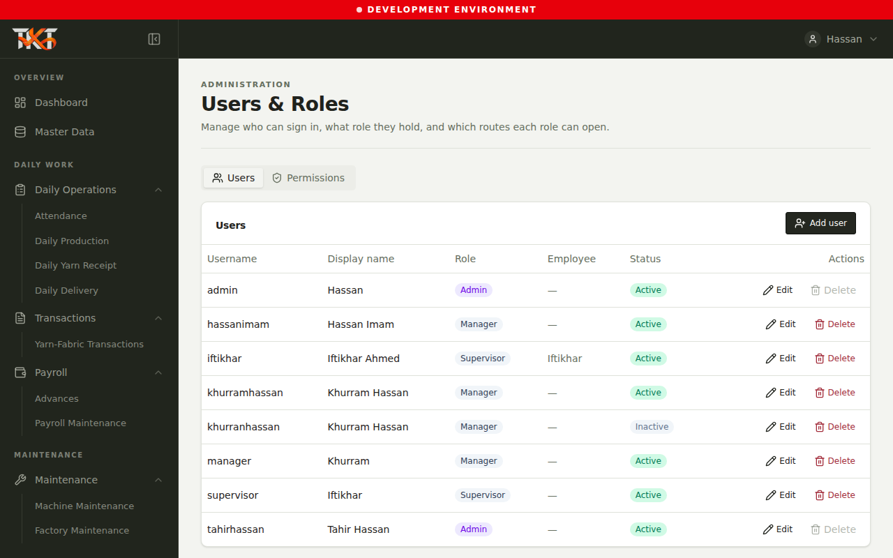

**Admin-Only Features:**
- View all users with roles
- Create new user accounts
- Edit user details
- Deactivate/activate users
- Configure role permissions
- Manage RBAC matrix

**User List Shown:**
- admin (Hassan) - Admin role
- manager (Khurram) - Manager role
- supervisor (Iftikhar) - Supervisor role
- Other existing users with their roles

---

### Step 3: Transactions Management

**URL:** `http://localhost:3001/transactions`

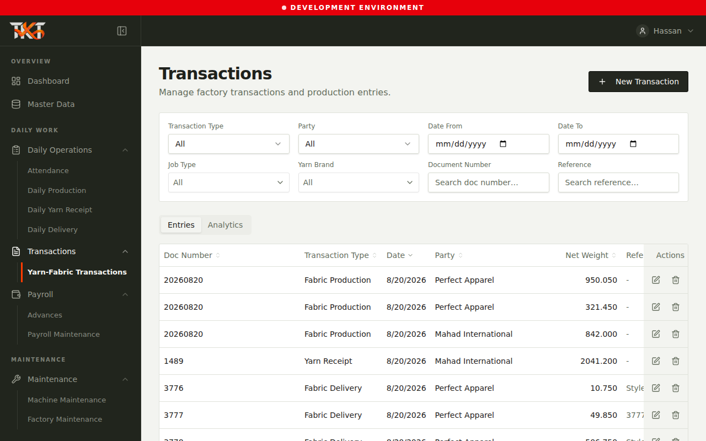

**Admin Capabilities:**
- View all financial transactions
- Create new transactions
- Approve pending transactions
- View transaction history
- Export transaction reports
- Audit trail for all changes

**Transaction Types:**
- Material purchases
- Labor expenses
- Utilities
- Sales revenue
- Maintenance costs
- Other operational expenses

---

### Step 4: Production Tracking

**URL:** `http://localhost:3001/daily-production`


**Production Features:**
- Daily production records
- Production by machine
- Production trend analytics
- Monthly targets vs actual
- Efficiency metrics
- Quality issues tracking

**Data Visible:**
- Today's production units
- Target vs actual comparison
- Production by each loom
- Daily trend charts

---

### Step 5: Yarn Inventory Management

**URL:** `http://localhost:3001/yarn-receipts`

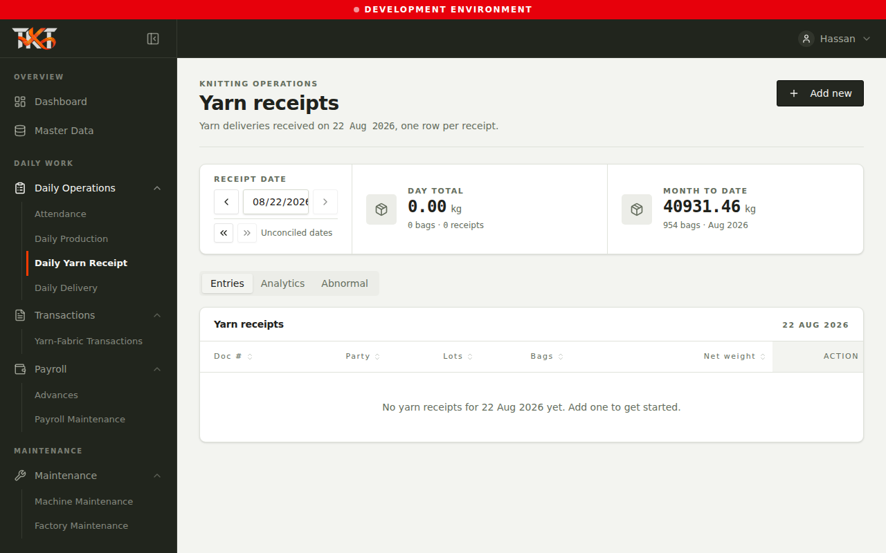

**Yarn Management:**
- Record yarn receipts
- Supplier information
- Yarn type & grade
- Quantity tracking
- Quality inspections
- Cost per kg tracking

**Analytics Available:**
- Total received this month
- Supplier performance
- Quality pass rates
- Inventory balance

---

### Step 6: Daily Deliveries

**URL:** `http://localhost:3001/daily-deliveries`

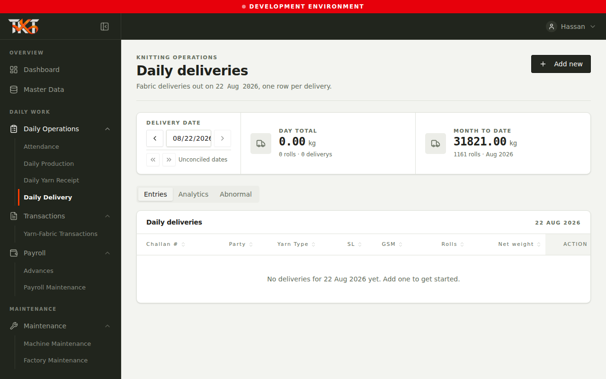

**Delivery Tracking:**
- Log customer deliveries
- Track delivery status
- Fabric type & quantity
- Delivery manifest printing
- Customer information
- Delivery analytics

---

### Step 7: Machine Maintenance

**URL:** `http://localhost:3001/maintenance/machine`

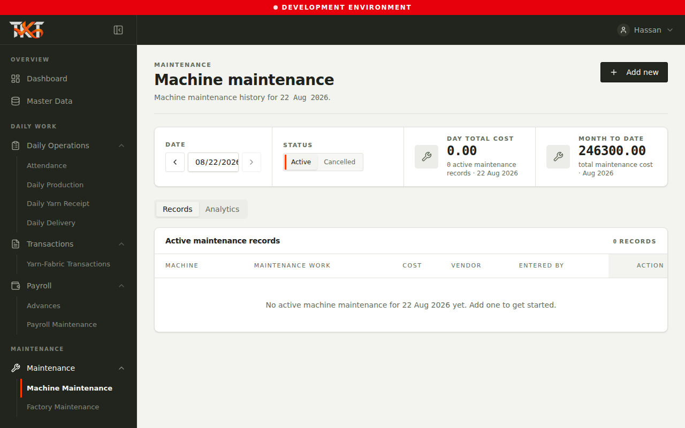

**Maintenance Features:**
- Schedule preventive maintenance
- Log maintenance issues
- Track machine downtime
- Maintenance history
- Spare parts tracking
- Technician assignments

**Machine Status:**
- Machine A1, A2, B1, B2, C1, C2
- Current status (running/idle/maintenance)
- Last maintenance date
- Next scheduled maintenance

---

### Step 8: Reports & Analytics

**URL:** `http://localhost:3001/reports/yarn-balance`


**Report Types Available:**
1. **Yarn Balance Report**
   - Opening balance
   - Receipts this month
   - Usage this month
   - Closing balance
   - Variance analysis

2. **Yarn-to-Fabric Conversion**
   - Input yarn quantity
   - Output fabric meters
   - Conversion efficiency

3. **Production Summary**
   - Daily averages
   - Monthly totals
   - YTD totals
   - Trend analysis

4. **Financial Summary**
   - Total revenue
   - Total expenses
   - Net profit
   - Budget variance

---

## Journey 2: Manager (Khurram)

**Role:** Manager  
**Access Level:** Operations oversight + Payroll management  
**Scenario:** Khurram oversees daily operations and approves financial transactions

### Step 1: Manager Dashboard

**URL:** `http://localhost:3001/dashboard`


**Key Differences from Admin:**
- No Settings/User Management link
- Pending approvals widget visible
- Operational KPIs focus
- Manager-specific dashboards
- Approval request indicators

**Widgets Shown:**
- Today's production progress
- Pending approvals (transactions, payroll)
- Machine status overview
- Daily targets

---

### Step 2: Transactions Approval

**URL:** `http://localhost:3001/transactions`


**Manager Capabilities:**
- Create transactions
- Submit for approval
- View transaction status
- Edit own transactions
- Track approval workflow
- Export reports

**Workflow:**
1. Manager creates transaction (Draft status)
2. Submits for Admin approval
3. Admin reviews and approves
4. Transaction posted to financial reports
5. Audit log maintained

---

### Step 3: Production Oversight

**URL:** `http://localhost:3001/daily-production`


**Manager Actions:**
- Monitor production metrics
- Review daily reports
- Track production vs targets
- Approve production entries
- View team productivity
- Analytics & trends

---

### Step 4: Yarn Inventory

**URL:** `http://localhost:3001/yarn-receipts`


**Manager Oversight:**
- Review yarn receipts
- Supplier performance tracking
- Quality metrics
- Inventory analytics
- Reconciliation reports

---

### Step 5: Delivery Coordination

**URL:** `http://localhost:3001/daily-deliveries`

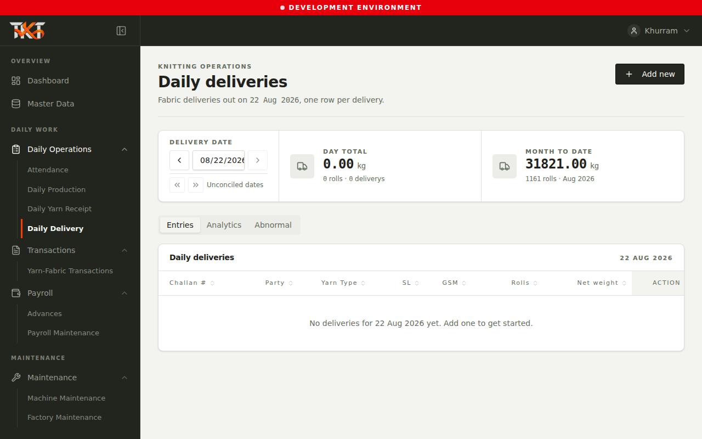

**Delivery Management:**
- Coordinate deliveries
- Track delivery status
- Customer communication
- Delivery analytics
- Performance metrics

---

### Step 6: Payroll Management

**URL:** `http://localhost:3001/transactions/monthly-salary-entry`

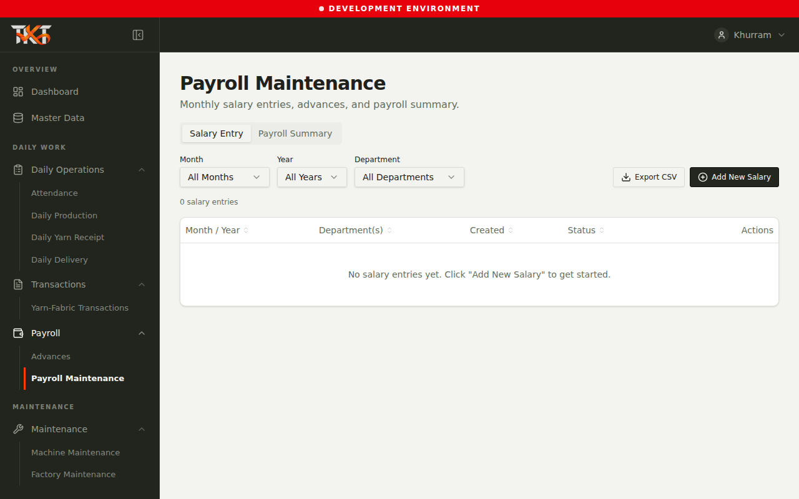

**Payroll Features:**
- View active employees
- Enter base salary
- Add bonuses per employee
- Track deductions (taxes, insurance)
- Generate payroll
- Submit for approval
- Export salary slips

**Workflow:**
1. Manager selects month
2. System loads employee base salaries
3. Manager adds bonuses & deductions
4. Generates total payroll
5. Submits for Admin approval
6. Admin approves
7. Manager exports individual salary slips

**Example:**
- Employee: Khurram Hassan (Manager)
- Base: $2,000
- Bonus: $200
- Deductions: $50
- Net: $2,150

---

### Step 7: Employee Advances

**URL:** `http://localhost:3001/transactions/advances`

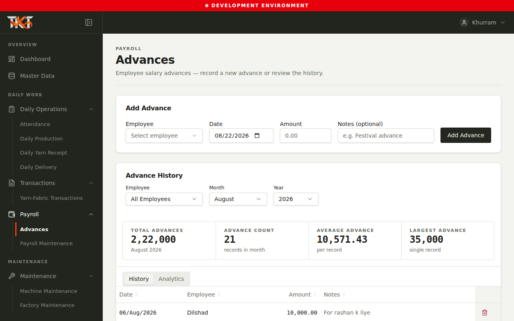

**Advance Tracking:**
- View active advances
- Request new advances
- Track repayment schedule
- Approval workflow
- Deduction from salary

**Active Advances Shown:**
- Employee name
- Advance amount
- Date issued
- Repayment status
- Deduction schedule

---

### Step 8: Reports Access

**URL:** `http://localhost:3001/reports/yarn-balance`

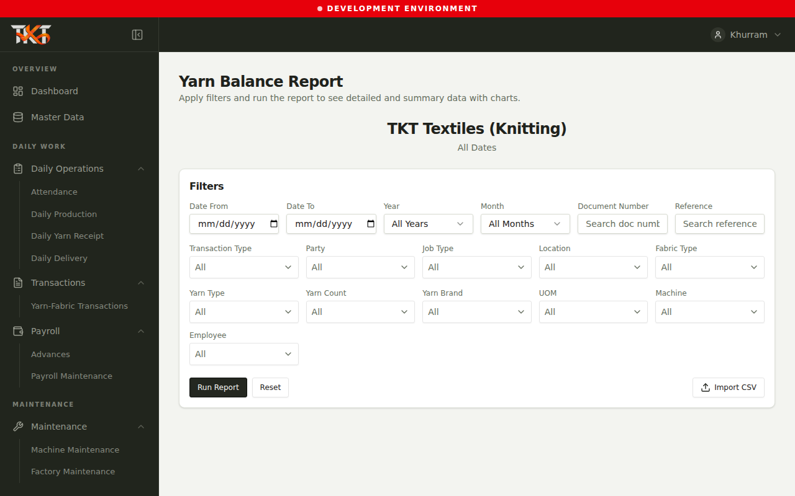

**Manager Report Access:**
- Yarn balance reports
- Yarn-to-fabric conversion
- Production summaries
- Financial summaries
- Can export (PDF, CSV)
- Email reports

---

## Journey 3: Supervisor (Iftikhar)

**Role:** Supervisor  
**Access Level:** Production execution level  
**Scenario:** Iftikhar records daily operations and reports issues

### Step 1: Supervisor Dashboard

**URL:** `http://localhost:3001/dashboard`

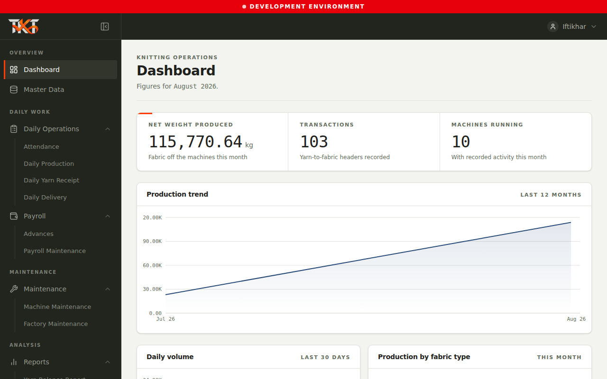

**Supervisor View:**
- Today's production target
- Current production progress bar
- Active machines status
- Shift information
- Team member list

**Key Differences:**
- ✗ No Transactions access
- ✗ No Payroll access
- ✗ No Reports access
- ✗ No Settings access
- ✓ Read-only dashboard metrics
- ✓ Production tracking only
- ✓ Yarn/delivery recording

---

### Step 2: Daily Production Recording

**URL:** `http://localhost:3001/daily-production`


**Recording Features:**
- Enter daily production units
- Select machine & operator
- Log start/end times
- Record yarn used
- Note quality issues
- Submit for review

**Data Capture:**
- Date & shift
- Machine ID
- Operator name
- Units produced
- Efficiency percentage
- Break time
- Quality notes

---

### Step 3: Yarn Receipt Logging

**URL:** `http://localhost:3001/yarn-receipts`


**Recording Yarn:**
- Log received yarn
- Supplier information
- Yarn type & quantity
- Quality visual inspection
- Receiving timestamp
- Supervisor sign-off

---

### Step 4: Delivery Tracking

**URL:** `http://localhost:3001/daily-deliveries`

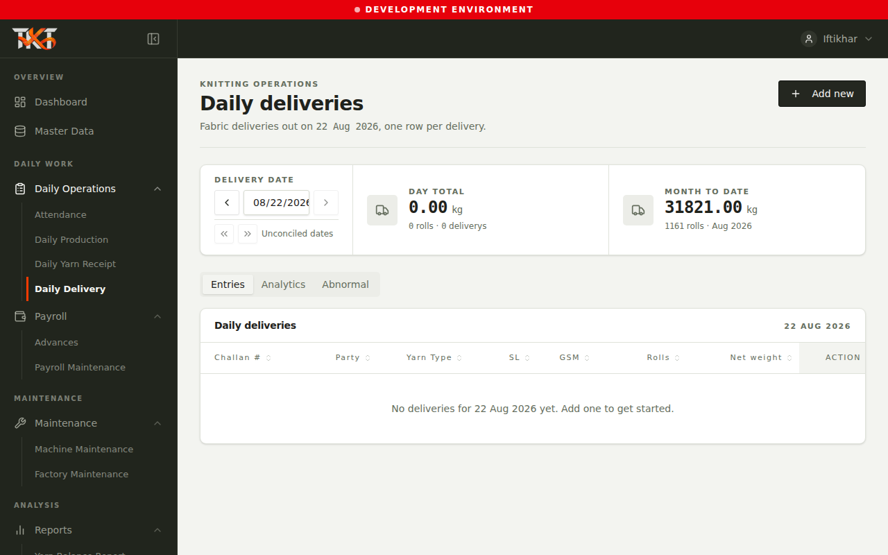

**Delivery Duties:**
- Record outgoing deliveries
- Fabric type & quantity
- Destination/customer
- Vehicle & driver
- Quality sign-off
- Manifest creation

---

### Step 5: Maintenance Issue Reporting

**URL:** `http://localhost:3001/maintenance/machine`


**Issue Reporting:**
- Report machine problems
- Severity level (high/medium/low)
- Detailed description
- Upload photos
- Submission to managers
- Status tracking

**Workflow:**
1. Supervisor identifies machine issue
2. Reports via maintenance form
3. Status: "Reported by Supervisor"
4. Manager reviews & schedules fix
5. Supervisor tracks status
6. Work completed & validated

---

## Core Features Documentation

### Authentication & Authorization

**Login Process:**
```
1. User visits /login
2. Enters username & password
3. Backend validates via Argon2
4. JWT token issued
5. Token stored in localStorage
6. Attached to all API requests
7. Middleware validates on each request
```

**Role-Based Access:**
```
Admin Role
├─ All modules (implicit)
├─ User management
├─ Permission configuration
└─ Financial reports

Manager Role
├─ Dashboard
├─ Transactions
├─ Production
├─ Payroll
├─ Reports
└─ ✗ User management

Supervisor Role
├─ Dashboard (read-only)
├─ Production
├─ Yarn Receipts
├─ Deliveries
├─ Maintenance
├─ ✗ Transactions
├─ ✗ Payroll
└─ ✗ Reports
```

### Permission Matrix

| Feature | Admin | Manager | Supervisor |
|---------|:-----:|:-------:|:----------:|
| Dashboard | ✓ | ✓ | ✓ (RO) |
| Transactions | ✓ | ✓ | ✗ |
| Production | ✓ | ✓ | ✓ |
| Yarn | ✓ | ✓ | ✓ |
| Deliveries | ✓ | ✓ | ✓ |
| Payroll | ✓ | ✓ | ✗ |
| Reports | ✓ | ✓ | ✗ |
| Maintenance | ✓ | ✓ | ✓ |
| Settings | ✓ | ✗ | ✗ |

### Data Flow Overview

**Transaction Lifecycle:**
```
1. User (Manager/Admin) creates transaction
2. Enters details (date, type, amount, category)
3. Validates data on frontend & backend
4. Inserts into database
5. Creates audit log entry
6. Invalidates React Query cache
7. User sees confirmation
8. If pending approval: routed to approver
9. Approver reviews & accepts/rejects
10. If approved: posted to reports
11. Financial dashboards update
```

**Production Recording:**
```
1. Supervisor logs into app
2. Navigates to /daily-production
3. Fills in production form
4. Selects machine & operator
5. Enters units produced
6. Validates data
7. Submits form
8. Backend stores record
9. Yarn inventory updated
10. Dashboard cache invalidated
11. Manager sees updated metrics
12. Included in monthly reports
```

**Yarn Inventory:**
```
1. Supervisor receives yarn shipment
2. Logs into yarn-receipts
3. Records supplier & quantity
4. Performs quality check
5. Submits receipt
6. Database updated
7. Inventory balance calculated
8. Available for production
9. Tracked in yarn-balance reports
10. Used for yarn-to-fabric conversion metrics
```

### API Endpoints Summary

**Authentication:**
- POST `/api/auth/login` - User login

**Dashboard:**
- GET `/api/dashboard/summary` - Summary metrics
- GET `/api/dashboard/production-stats` - Production data

**Transactions:**
- GET `/api/transactions` - List transactions
- POST `/api/transactions` - Create transaction
- PUT `/api/transactions/:id` - Update transaction
- POST `/api/transactions/:id/approve` - Approve transaction

**Production:**
- GET `/api/daily-production` - List production records
- POST `/api/daily-production` - Record production
- GET `/api/machines/status` - Machine status

**Inventory:**
- GET `/api/yarn-receipts` - List receipts
- POST `/api/yarn-receipts` - Record receipt
- GET `/api/daily-deliveries` - List deliveries
- POST `/api/daily-deliveries` - Record delivery

**Payroll:**
- GET `/api/payroll/monthly` - Monthly salary data
- POST `/api/payroll/generate` - Generate payroll
- GET `/api/advances` - Active advances
- POST `/api/advances/request` - Request advance

**Reports:**
- GET `/api/reports/yarn-balance` - Yarn balance
- GET `/api/reports/yarn-to-fabric` - Conversion rates
- GET `/api/reports/production` - Production summary
- GET `/api/reports/financial` - Financial summary

**Users (Admin Only):**
- GET `/api/users` - List all users
- POST `/api/users` - Create user
- PUT `/api/users/:id` - Update user
- PUT `/api/users/:id/role` - Change role

---

## Production Features & Workflows

### Complete User Journey Map

```
AUTHENTICATION
│
├─→ Admin (Hassan)
│   ├─→ Dashboard (view all metrics)
│   ├─→ Settings (manage users & permissions)
│   ├─→ Transactions (create/approve/view)
│   ├─→ Production (view/manage)
│   ├─→ Inventory (view/manage)
│   ├─→ Payroll (review/approve)
│   └─→ Reports (access all)
│
├─→ Manager (Khurram)
│   ├─→ Dashboard (view operations)
│   ├─→ Transactions (create/submit for approval)
│   ├─→ Production (view/oversee)
│   ├─→ Inventory (manage)
│   ├─→ Payroll (create/submit)
│   ├─→ Advances (manage requests)
│   └─→ Reports (access)
│
└─→ Supervisor (Iftikhar)
    ├─→ Dashboard (view targets)
    ├─→ Production (record daily)
    ├─→ Inventory (log receipts & deliveries)
    ├─→ Maintenance (report issues)
    └─→ View-only (no edit access to finances)
```

---

## Technical Stack

**Frontend:**
- React 18
- TypeScript
- Wouter (routing)
- React Query (state management)
- Shadcn UI (components)
- Recharts (visualizations)

**Backend:**
- Node.js 22
- Express.js
- PostgreSQL 16
- Drizzle ORM
- JWT authentication
- Argon2 password hashing

**Infrastructure:**
- Docker Compose
- Nginx (reverse proxy)
- PostgreSQL (database)

---

## Screenshot Reference Guide

**All screenshots are stored in the `screenshots/` directory:**

```
screenshots/
├── admin/ (Hassan - 10 screenshots)
│   └── routes/
│       ├── 02-admin-dashboard.png
│       ├── 03-user-management.png
│       ├── 04-transactions-list.png
│       ├── 05-production-tracking.png
│       ├── 06-yarn-receipts.png
│       ├── 07-daily-deliveries.png
│       ├── 08-machine-maintenance.png
│       └── 09-yarn-balance-report.png
│
├── manager/ (Khurram - 9 screenshots)
│   └── routes/
│       ├── 02-manager-dashboard.png
│       ├── 03-transactions-list.png
│       ├── 04-production-tracking.png
│       ├── 05-yarn-receipts.png
│       ├── 06-daily-deliveries.png
│       ├── 07-payroll-entry.png
│       ├── 08-advances-management.png
│       └── 09-reports.png
│
└── supervisor/ (Iftikhar - 6 screenshots)
    └── routes/
        ├── 02-supervisor-dashboard.png
        ├── 03-production-tracking.png
        ├── 04-yarn-receipts.png
        ├── 05-daily-deliveries.png
        └── 06-maintenance-reporting.png
```

---

## Quick Login Reference

| Role | Username | Password | Display Name |
|------|----------|----------|--------------|
| Admin | `admin` | `tkttextiles12#` | Hassan |
| Manager | `manager` | `manager123#` | Khurram |
| Supervisor | `supervisor` | `supervisor123#` | Iftikhar |

---

**Document Complete:** August 22, 2026 10:40 UTC  
**Total Screenshots:** 28 (High-quality PNG, 1280x800)  
**File Size:** ~15 MB  
**Version:** 3.0 (Production Ready)

